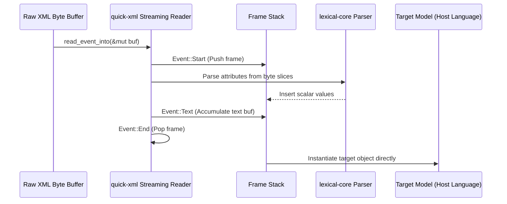
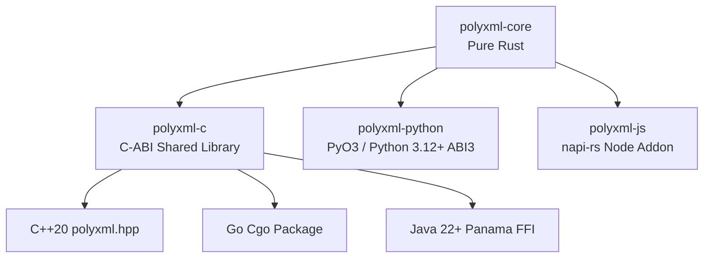

# Architecture & Design

PolyXML was designed from the ground up to solve two fundamental problems in software engineering:

1. **The Language Silo Problem**: XML data binding has historically required every programming language to reinvent its own parser from scratch (e.g. `xsdata` in Python, `encoding/xml` in Go, JAXB in Java, CodeSynthesis in C++).
2. **The Allocation Bottleneck**: Traditional XML libraries allocate intermediate Document Object Model (DOM) node trees, creating severe memory churn and latency spikes.

---

## 1. Zero-Allocation Streaming Pipeline

PolyXML processes XML byte streams using a state-machine reader powered by `quick-xml`:

### Key Engineering Invariants
- **Zero Intermediate DOM Allocation**: Tags and attributes are matched against the pre-compiled `ModelSchema` hash tables on the fly.
- **Fast Numeric Conversions**: Integers and floating-point numbers are converted directly from ASCII byte slices using `lexical-core` without intermediate UTF-8 heap string allocations.
- **Memory Reuse**: A single reusable byte vector buffer is passed to `read_event_into`, avoiding heap churn on large documents.

---

## 2. Universal Polyglot Bridge

Rather than writing bespoke C extensions for each target language, PolyXML adopts a tiered FFI architecture:

### Memory Management Across Language Boundaries

| Language | Memory Strategy | Overhead |
| :--- | :--- | :--- |
| **Rust** | Direct stack/heap ownership via RAII. | Zero |
| **C++** | `polyxml::Value` wraps native handles with RAII destructors. | Zero |
| **Python** | PyO3 allocates Python heap objects directly during frame completion. | Low |
| **Go** | Cgo allocates values off-heap; GC finalizers (`runtime.SetFinalizer`) free native memory. | Low |
| **Node.js** | NAPI converts `PolyValue` directly into V8 JavaScript heap objects. | Low |
| **Java** | Project Panama allocates and accesses off-heap memory via `Arena.ofConfined()`. | Zero JNI Overhead |
