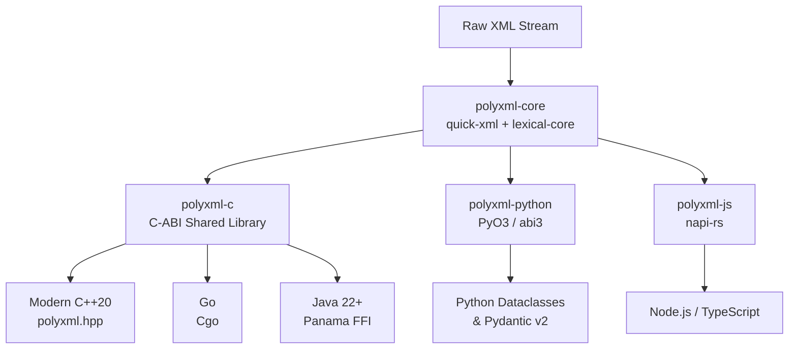

# PolyXML

  <strong>The Universal Native XML Data-Binding Engine</strong>

---

## Welcome to PolyXML

**PolyXML** is a high-performance native XML engine written in Rust for ultra-fast, streaming XML serialization and deserialization. It bridges raw XML directly to strongly-typed data structures across modern language runtimes with **zero unnecessary allocations**.

While web ecosystems shifted toward JSON and Protocol Buffers, mission-critical infrastructure in **defense & aerospace (UCI)**, **finance (ISO 20022, FIXML)**, and **healthcare (HL7)** remains deeply reliant on XML. PolyXML breaks down language barriers and eliminates legacy performance penalties by providing **one unified, native Rust engine for all tech stacks**.

---

## Supported Ecosystems

=== "Rust"
    Native zero-copy core engine via `polyxml-core` on [crates.io](https://crates.io/crates/polyxml-core). Monomorphized, fast streaming parser.

=== "Python"
    Accelerates Python `dataclasses` and **Pydantic v2** models via PyO3 (`abi3-py312`). 10x–30x faster than pure Python XML parsers.

=== "Modern C++20"
    Zero-overhead modern C++20 header-only wrapper (`polyxml.hpp`) with RAII memory management, designed for avionics, robotics, and defense.

=== "Go"
    High-throughput Cgo wrapper providing `polyxml.Unmarshal` and `polyxml.Marshal`, replacing Go's slow reflection-based `encoding/xml`.

=== "TypeScript & Node"
    Native Node.js addon compiled via `napi-rs` with full TypeScript definitions (`index.d.ts`), ideal for high-throughput microservices.

=== "Java (Panama FFI)"
    Java 22+ Foreign Function & Memory API (JEP 454) binding directly to off-heap memory with zero JNI boilerplate.

---

## Architecture at a Glance

---

## Next Steps

- Check out the [5-Minute Multi-Language Quickstart](quickstart.md) to see PolyXML in action.
- Read about our [Architecture & Streaming Design](architecture.md).
- Explore [Performance & Benchmarks](benchmarks.md).
