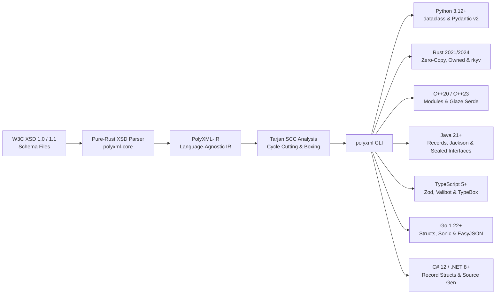
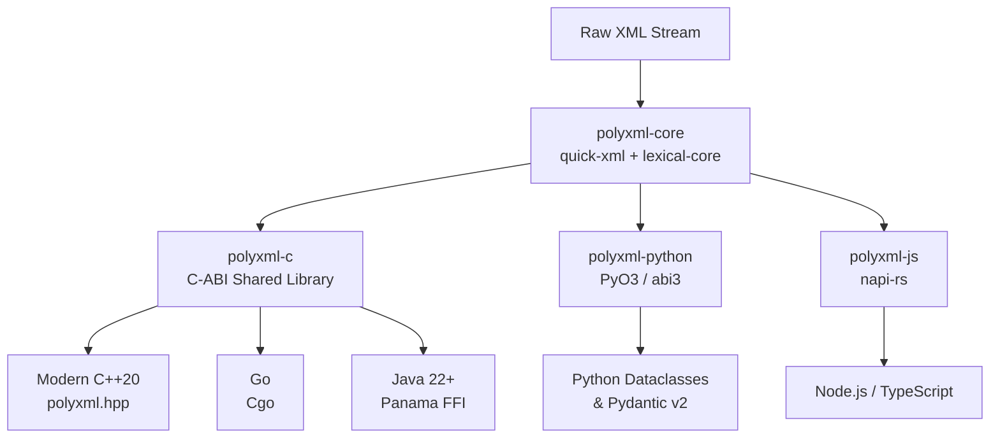

# PolyXML


<p align="center">
  <strong>The "protoc for XML" — Modern XSD-to-Code Generator & High-Performance Streaming Runtime</strong><br>
  <em>Python • Rust • C++20 • Java 21+ • TypeScript • Go • C# 12</em>
</p>

---

## Welcome to PolyXML

**PolyXML turns W3C XML Schemas (`.xsd`) into production-ready, type-safe data models with built-in streaming parsers and serializers.** Written in safe Rust, it compiles schemas once and generates idiomatic, strongly-typed code across 7 modern language runtimes with **zero intermediate DOM allocations**.

While web ecosystems shifted toward JSON and Protocol Buffers, mission-critical infrastructure in **defense & aerospace (UCI)**, **finance (ISO 20022, FIXML)**, and **healthcare (HL7)** remains deeply reliant on XML. PolyXML breaks down language barriers and eliminates legacy performance penalties by providing **one unified, native Rust engine for all tech stacks**.

---

## Supported Ecosystems

=== "Rust"
    Native zero-copy core engine via `polyxml` on [crates.io](https://crates.io/crates/polyxml). Monomorphized, fast streaming parser.

=== "Python"
    Accelerates Python `dataclasses` and **Pydantic v2** models via PyO3 (`abi3-py312`). 10x–24x faster than pure Python XML parsers.

=== "Modern C++20"
    Zero-overhead modern C++20 header-only wrapper (`polyxml.hpp`) with RAII memory management, designed for avionics, robotics, and defense.

=== "Go"
    High-throughput Cgo wrapper providing `polyxml.Deserialize` and `polyxml.Serialize`, replacing Go's slow reflection-based `encoding/xml`.

=== "TypeScript & Node"
    Native Node.js addon compiled via `napi-rs` with full TypeScript definitions (`index.d.ts`), ideal for high-throughput microservices.

=== "Java (Panama FFI)"
    Java 22+ Foreign Function & Memory API (JEP 454) binding directly to off-heap memory with zero JNI boilerplate.

=== "C# 12 / .NET 8+"
    Modern immutable records with primary constructors, standard `System.Xml.Serialization` attributes, polymorphic `xs:choice` hierarchies, and built-in facet validation.

---

## ⚡ Why PolyXML? (Old Way vs. PolyXML Way)

```
Legacy XML Toolchains (JAXB, CodeSynthesis, xsdata, xgen)
❌ Language Silos: Fragmented, unmaintained open-source or costly commercial tools.
❌ Memory Bloat: Intermediate DOM allocations cause 10x-20x memory churn & GC spikes.
❌ Antiquated Code: Sprawling pre-C++11 raw pointers and mutable JavaBeans with getters/setters.
❌ Licensing Traps: GPL v2 dual-licensing or per-seat commercial paywalls (CodeSynthesis, gSOAP).
❌ Security Exposure: Vulnerable by default to XXE file exfiltration (e.g. lxml/xsdata CWE-611).

The PolyXML Way
✅ Unified Rust Tool: Generates idiomatic, type-safe code (like protoc) across 7 languages.
✅ Zero-Allocation Streaming: Direct-to-struct parsing with quick-xml & lexical-core (10x–24x faster).
✅ Dual-Format XML ↔ JSON: Whole-document transcoding (`polyxml transcode`) and dual-annotated models.
✅ Modern Language Idioms: Immutable Java 21+ records, C++20 value types, Python 3.12 PEP 695 dataclasses.
✅ Secure by Design: Pure-Rust streaming parser structurally immune to XXE (CWE-611) & SSRF.
✅ 100% Permissive MIT: Zero commercial licensing fees, zero GPL infection risk.
```

👉 **[Read the Full Architectural Comparison & Head-to-Head Benchmarks →](why-polyxml.md)**

---

## 🛠️ Universal XSD-to-Code Generation

PolyXML includes a full-fledged CLI toolchain (`polyxml`) that transforms W3C XSD 1.0 and 1.1 schemas into strongly-typed data contracts and high-performance codecs across all **7 target ecosystems**:



Tested against the official **W3C XML Schema Test Suite (XSTS)** with **>99.8% schema compilation pass rate** and **>96% round-trip validation pass rate** via [polyxml-w3c-tests](https://github.com/polyxml/polyxml-w3c-tests).

---

## Architecture at a Glance



---

## 🌐 Real-World Industry Showcases

Explore complete, production-ready example repositories showcasing PolyXML in mission-critical industries across **all 7 supported languages**:

- **[🛸 Defense & Aerospace (polyxml-defense-examples)](https://github.com/polyxml/polyxml-defense-examples)**:
  Bridges autonomous edge telemetry from the **Anduril Lattice SDK** (Protobuf/JSON) with the **USAF Universal Command and Control Interface (UCI v2.5)** XML standard. Demonstrates sub-10μs telemetry transcoding and C2 mission routing in flight software.
- **[💳 Global Finance & Banking (polyxml-finance-examples)](https://github.com/polyxml/polyxml-finance-examples)**:
  Bridges real-time **FinTech payment webhooks (FedNow, Stripe, Plaid JSON)** with the global banking standard **ISO 20022 `pacs.008` (Customer Credit Transfer XML)**. Demonstrates high-throughput interbank settlement, Java 21 Jackson models, and C# source-gen.
- **[🚍 Smart Cities & Public Transit (polyxml-transit-examples)](https://github.com/polyxml/polyxml-transit-examples)**:
  Bridges live **Google GTFS-Realtime** (Protobuf/JSON) feeds with European **CEN SIRI v2.0 (EN 15531)** & **NeTEx (CEN/TS 16614)** XML standards. Demonstrates live passenger vehicle positioning and TypeScript schema validation.

---

## Next Steps

- Check out the [5-Minute Multi-Language Quickstart](quickstart.md) to see PolyXML in action.
- Read about our [XSD-to-Code Generator & CLI Toolchain](guides/compiler.md).
- Choose a [language guide](languages/index.md) for your ecosystem.
- Learn how [Polymorphic Types & `xsi:type` Dispatch](guides/polymorphism.md) work at runtime.
- Read about our [Architecture & Streaming Design](architecture.md).
- Explore [Performance & Benchmarks](benchmarks/index.md).
